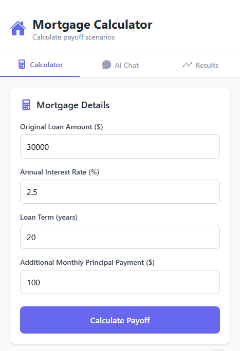

# Mortgage Calculator 📱💰

A comprehensive and user-friendly mortgage calculator built with React Native and Expo. Calculate monthly payments, total interest, and amortization schedules with ease.

## ✨ Features

### Core Calculator
- **Mortgage Payoff Calculator**: Calculate how additional principal payments accelerate loan payoff
- **Interest Savings Analysis**: See exactly how much interest you'll save with extra payments
- **Timeline Comparison**: Visual comparison between original and accelerated payment schedules
- **Interactive Loan Timeline Chart**: Real-time visualization using Recharts showing balance reduction over time
- **Flexible Payment Scenarios**: Test different additional payment amounts
- **Custom Start Date**: Set your actual loan start date for accurate projections

### AI-Powered Assistant
- **Natural Language Processing**: Ask questions in plain English about mortgage scenarios
- **Smart Scenario Analysis**: Get instant answers to questions like "How much will I save with $300 extra per month?"
- **Payoff Timeline Predictions**: Ask "Can I finish my mortgage in 20 years?" and get detailed calculations
- **Interactive Chat Interface**: Real-time conversation with AI mortgage advisor
- **Context-Aware Responses**: AI understands your specific loan details for personalized advice

### User Experience
- **Modern Responsive Design**: Beautiful gradient interface optimized for all devices
- **Real-time Validation**: Instant form validation with helpful error messages
- **Professional Data Visualization**: Clean charts and metrics with Recharts integration
- **Intuitive Input Forms**: Easy-to-use form controls with clear labeling
- **Results Dashboard**: Comprehensive display of savings, timeline, and payoff details

## 📱 Screenshots

| Calculator | AI Assistant | Results |
|-------------|---------------|---------|
|  |  |  |

## 🚀 Getting Started

### Prerequisites

Before running this application, make sure you have the following installed:

- [Node.js](https://nodejs.org/) (version 14 or higher)
- [npm](https://www.npmjs.com/) or [Yarn](https://yarnpkg.com/)
- [Expo CLI](https://docs.expo.dev/get-started/installation/)
- [Expo Go](https://expo.dev/client) app on your mobile device (for testing)

### Installation

1. **Clone the repository**
   ```bash
   git clone https://github.com/creative-dev-lab-stack/mortgage-calculator.git
   cd mortgage-calculator
   ```

2. **Install dependencies**
   ```bash
   npm install
   # or
   yarn install
   ```

3. **Start the development server**
   ```bash
   npx expo start
   # or
   yarn expo start
   ```

4. **Run on your device**
   - Install [Expo Go](https://expo.dev/client) on your iOS or Android device
   - Scan the QR code displayed in your terminal or browser
   - The app will load on your device

### Running on Simulators

**iOS Simulator (macOS only):**
```bash
npx expo start --ios
```

**Android Emulator:**
```bash
npx expo start --android
```

## 🏗️ Project Structure

```
mortgage-calculator/
├── assets/                 # Images, fonts, and other static assets
│   ├── images/
│   ├── icons/
│   └── fonts/
├── src/
│   ├── components/         # Reusable UI components
│   │   ├── Calculator/
│   │   ├── Charts/
│   │   ├── Forms/
│   │   └── UI/
│   ├── screens/           # App screens/pages
│   │   ├── HomeScreen.js
│   │   ├── CalculatorScreen.js
│   │   ├── ResultsScreen.js
│   │   └── SettingsScreen.js
│   ├── navigation/        # Navigation configuration
│   │   └── AppNavigator.js
│   ├── utils/            # Utility functions and helpers
│   │   ├── calculations.js
│   │   ├── formatting.js
│   │   └── storage.js
│   ├── constants/        # App constants and configurations
│   │   ├── Colors.js
│   │   ├── Styles.js
│   │   └── Config.js
│   └── hooks/            # Custom React hooks
│       ├── useCalculations.js
│       └── useStorage.js
├── App.js                # Main app component
├── app.json             # Expo configuration
├── package.json         # Dependencies and scripts
└── README.md           # This file
```

## ⚙️ Configuration

### Environment Variables

Create a `.env` file in the root directory (optional):

```env
# API Configuration (if using external services)
API_BASE_URL=https://api.example.com
API_KEY=your_api_key_here

# Analytics (if implemented)
ANALYTICS_ID=your_analytics_id
```

### App Configuration

Modify `app.json` to customize app settings:

```json
{
  "expo": {
    "name": "Mortgage Calculator",
    "slug": "mortgage-calculator",
    "version": "1.0.0",
    "orientation": "portrait",
    "icon": "./assets/icon.png",
    "splash": {
      "image": "./assets/splash.png",
      "resizeMode": "contain",
      "backgroundColor": "#ffffff"
    },
    "platforms": ["ios", "android", "web"]
  }
}
```
## 🤖 AI Assistant Features

The built-in AI mortgage assistant can help you explore different scenarios through natural conversation:

### Supported Question Types

**Payment Scenarios:**
- "How much will I save with $300 extra per month?"
- "What if I add $500 to my monthly payment?"
- "Can I save money by paying an additional $200?"

**Payoff Timeline:**
- "Can I finish my mortgage in 20 years?"
- "How much extra do I need to pay to payoff in 15 years?"
- "When will I be done if I pay $400 more monthly?"

**Interest Savings:**
- "How much interest will I save with extra payments?"
- "What's my total interest savings?"
- "How much less interest will I pay?"

**General Calculations:**
- "What's the best additional payment amount?"
- "How do extra payments help?"
- "Show me different payment scenarios"

## 🧮 Mortgage Calculation Logic

The app uses standard mortgage calculation formulas:

### Monthly Payment Formula
```
M = P × [r(1 + r)^n] / [(1 + r)^n - 1]
```

Where:
- M = Monthly payment
- P = Principal loan amount
- r = Monthly interest rate (annual rate ÷ 12)
- n = Total number of payments (years × 12)

### Key Calculations Included
- **Principal & Interest**: Core monthly payment
- **Property Taxes**: Annual tax ÷ 12
- **PMI**: Private Mortgage Insurance (if down payment < 20%)
- **Homeowner's Insurance**: Annual premium ÷ 12
- **Total Monthly Payment**: Sum of all components

## 🎨 Customization

### Themes and Styling

The app supports customizable themes. Modify colors in `src/constants/Colors.js`:

```javascript
export const Colors = {
  primary: '#007AFF',
  secondary: '#5AC8FA',
  background: '#F2F2F7',
  text: '#000000',
  // ... more colors
};
```

### Adding New Features

1. **Create new components** in `src/components/`
2. **Add screens** in `src/screens/`
3. **Update navigation** in `src/navigation/AppNavigator.js`
4. **Add calculations** in `src/utils/calculations.js`

## 📦 Dependencies

### Core Dependencies
- **expo**: ~53.0.9
- **react**: 19.0.0
- **react-native**: 0.79.2
- **@expo/vector-icons**: ^14.1.0
- **react-native-chart-kit**: ^6.12.0
- **react-native-svg**: 15.11.2

### UI Libraries
- **react-native-vector-icons**: Icons
- **react-native-chart-kit**: Charts and graphs

## 🧪 Testing

Run the test suite:

```bash
npm test
# or
yarn test
```

### Test Coverage
- Unit tests for calculation functions
- Component rendering tests
- Navigation flow tests
- Input validation tests

## 📱 Building for Production

### Create Production Build

**Android:**
```bash
npx expo build:android
```

**iOS:**
```bash
npx expo build:ios
```

### Using EAS Build (Recommended)

1. **Install EAS CLI:**
   ```bash
   npm install -g @expo/eas-cli
   ```

2. **Configure EAS:**
   ```bash
   eas build:configure
   ```

3. **Build for Android:**
   ```bash
   eas build --platform android
   ```

4. **Build for iOS:**
   ```bash
   eas build --platform ios
   ```

## 🔧 Troubleshooting

### Common Issues

**Metro bundler issues:**
```bash
npx expo start --clear
```

**iOS simulator not launching:**
```bash
sudo xcode-select --switch /Applications/Xcode.app/Contents/Developer
```

**Android emulator connection issues:**
```bash
adb kill-server
adb start-server
```

**Package installation errors:**
```bash
rm -rf node_modules
rm package-lock.json
npm install
```

## 🤝 Contributing

We welcome contributions! Please follow these steps:

1. **Fork the repository**
2. **Create a feature branch**
   ```bash
   git checkout -b feature/amazing-feature
   ```
3. **Commit your changes**
   ```bash
   git commit -m 'Add some amazing feature'
   ```
4. **Push to the branch**
   ```bash
   git push origin feature/amazing-feature
   ```
5. **Open a Pull Request**

### Development Guidelines
- Follow React Native best practices
- Write tests for new features
- Update documentation as needed
- Use meaningful commit messages
- Ensure code passes linting

## 📄 License

This project is licensed under the MIT License - see the [LICENSE](LICENSE) file for details.

```
MIT License

Copyright (c) 2025 Creative Dev Lab Stack

Permission is hereby granted, free of charge, to any person obtaining a copy
of this software and associated documentation files (the "Software"), to deal
in the Software without restriction, including without limitation the rights
to use, copy, modify, merge, publish, distribute, sublicense, and/or sell
copies of the Software, and to permit persons to whom the Software is
furnished to do so, subject to the following conditions:

The above copyright notice and this permission notice shall be included in all
copies or substantial portions of the Software.

THE SOFTWARE IS PROVIDED "AS IS", WITHOUT WARRANTY OF ANY KIND, EXPRESS OR
IMPLIED, INCLUDING BUT NOT LIMITED TO THE WARRANTIES OF MERCHANTABILITY,
FITNESS FOR A PARTICULAR PURPOSE AND NONINFRINGEMENT. IN NO EVENT SHALL THE
AUTHORS OR COPYRIGHT HOLDERS BE LIABLE FOR ANY CLAIM, DAMAGES OR OTHER
LIABILITY, WHETHER IN AN ACTION OF CONTRACT, TORT OR OTHERWISE, ARISING FROM,
OUT OF OR IN CONNECTION WITH THE SOFTWARE OR THE USE OR OTHER DEALINGS IN THE
SOFTWARE.
```

## 👥 Authors

- **Creative Dev Lab Stack** - *Initial work* - [GitHub](https://github.com/creative-dev-lab-stack)

## 🙏 Acknowledgments

- Thanks to the React Native and Expo communities
- Mortgage calculation formulas based on standard banking practices
- UI inspiration from leading financial apps
- Icons provided by [React Native Vector Icons](https://github.com/oblador/react-native-vector-icons)

## 📞 Support

For support, please:
- Open an issue on GitHub
- Email us at support@creativedevlab.com
- Check our [documentation](https://github.com/creative-dev-lab-stack/mortgage-calculator/wiki)

## 🔮 Future Enhancements

### Short-term Roadmap
- [ ] **Enhanced AI Conversations**: More sophisticated natural language understanding
- [ ] **Payment Strategy Recommendations**: AI-suggested optimal payment strategies
- [ ] **Loan Comparison Tool**: Compare multiple mortgage scenarios side-by-side
- [ ] **Export Functionality**: PDF reports and email sharing of calculations
- [ ] **Save/Load Scenarios**: Persistent storage of different mortgage calculations

### Medium-term Features
- [ ] **Amortization Schedule View**: Detailed month-by-month payment breakdown
- [ ] **Refinancing Calculator**: Compare current mortgage vs refinancing options
- [ ] **Property Tax Integration**: Include property taxes and insurance in calculations
- [ ] **Investment Analysis**: Compare extra payments vs alternative investments
- [ ] **Mobile App Version**: Native iOS and Android applications

### Long-term Vision
- [ ] **Real Estate Market Integration**: Current mortgage rates and property values
- [ ] **Biweekly Payment Calculator**: Alternative payment frequency analysis
- [ ] **Multiple Currency Support**: International mortgage calculations
- [ ] **Advanced Charting**: Interactive 3D visualizations and detailed analytics
- [ ] **Social Features**: Share scenarios and get community feedback
- [ ] **API Integration**: Connect with banking and financial institutions
- [ ] **Machine Learning**: Personalized recommendations based on user behavior
- [ ] **Voice Interface**: Voice-activated mortgage calculations and AI conversations

---

**Happy Calculating! 🏠💙**